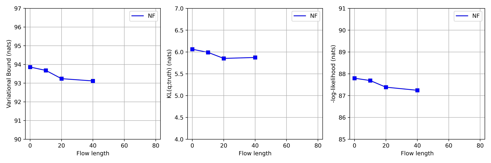
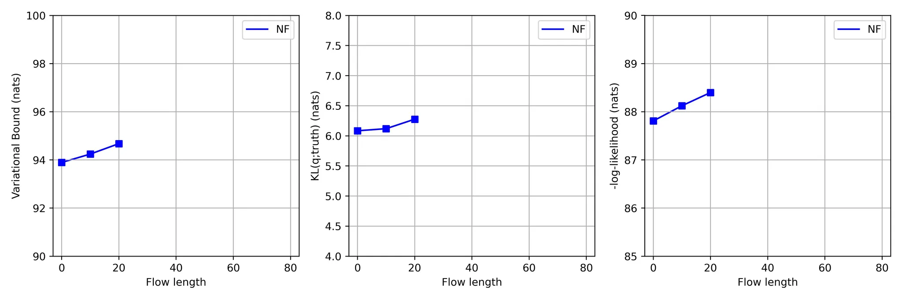
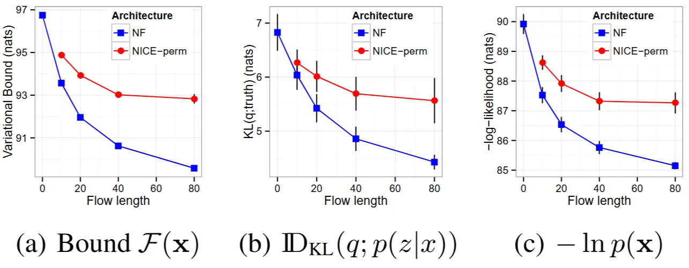

# Normalizing Flow
* Reproduction of <b><i><a href="https://arxiv.org/abs/1505.05770">\<Variational Inference with Normalizing Flows\></a></i></b> with PyTorch
# Settings
```
conda create -n nf python=3.12
conda activate nf
pip install -r requirements.txt

python train.py --config=dlgm.nf10.mnist
python test.py --config=dlgm.nf10.mnist
```

# Results / Report (Latest:25.11.20)
<table align="center">
  <tr>
    <td align="center">
      <br>
      <em>(a) This repo's result (Flow length 0, 10, 20, 40)</em>
    </td>
  </tr>
</table>

### 1. Why is the absolute performance better than that reported in the paper?
* The experimental results of my implementation surpass those reported in the original paper, except for the KL divergence, while the relative improvement from adding flow remains nearly identical. Although absolute performance levels differ, the $D_{KL}$ metric is comparable, which is particularly important given the paper’s objective of minimizing the discrepancy between the approximate and true posterior distributions, and it is notable that this performance is maintained. The superior absolute performance is likely due to differences in the interpretation and implementation of the Maxout nonlinearity in the architectures of the inference network (encoder) and the DLGM (decoder). In my implementation, the Maxout hidden dimension was reduced from 1600 to 400 following the paper; however, the original paper reports lower performance, suggesting that further reductions, for example from 400 to 100, may have been applied when using Maxout. <u><b>Most importantly, the addition of flow yields a substantially larger performance improvement compared to previous implementations, highlighting that the effect of the flow is now properly captured, which is the most significant observation.</b></u>

### 2. Why does the inference network predict the flow parameters?
* In my previous Limitation & Report, I implemented a flow with independent(static) parameters. However, this approach is conceptually flawed. <u><b>The flow parameters should be predicted by the inference network because they, like the true posterior $p(\mathbf{z}\vert\mathbf{x})$, depend on the input $\mathbf{x}$. While $\mathbf{x}$ determines the posterior’s shape, the flow parameters directly transform the base distribution and thus also act as posterior parameters.</b></u> Treating the flow as fixed across all inputs would ignore the input-dependent variations of the posterior, preventing it from accurately approximating $p(\mathbf{z}\vert\mathbf{x})$, and in that case the posterior would be more appropriately written as $p(\mathbf{z}\vert\mathbf{x};\lambda_{\text{flow}})$.

### 3. Why do I no longer need to consider issues like weight initialization that arose in the previous case?
* When the flow parameters are generated dynamically for each input $\mathbf{x}$, the encoder continuously updates, and the flow parameters are regenerated at every forward pass. This prevents the model from being trapped by a fixed, poorly initialized parameter. This prevents the model from becoming stuck in a fixed, poorly initialized state. In other words, while static parameters (as in the results of 25.11.16) can become permanently ineffective if poorly initialized, dynamic parameters (as in this results) continuously change with the input, <u><b>so a single poor initialization does not compromise the overall training.</b></u>

# Results / Limitation & Report (25.11.16)
<table align="center">
  <tr>
    <td align="center">
      <br>
      <em>(a) This repo's result (Flow length 0, 10, 20, 40)</em>
    </td>
  </tr>
  <tr>
    <td align="center">
      <br>
      <em>(b) This repo's result (w/o weight initialization, Flow length 0, 10, 20)</em>
    </td>
  </tr>
  <tr>
    <td align="center">
      <br>
      <em>(c) Original paper</em>
    </td>
  </tr>
</table>

* The performance difference from the original paper is shown in the figure above. In my implementation, the performance gain from adding Flow is smaller than what the original paper reports. To understand this discrepancy, I reviewed the paper again and identified one key difference: in the original implementation, <u><b>the parameters of each Flow are generated from the output of the Inference Network</b></u> <i>(in Sec 4.2.)</i>. Aside from this point, I am confident that the rest of my implementation follows the paper faithfully.
* This means the original paper uses flow-specific parameters conditioned on the encoder output, whereas my implementation uses separate learnable parameters for each Flow. While examining this detail, I made an interesting finding: <u><b> for Planar Flow, the choice of weight initialization has a critical impact when tanh is used as the nonlinearity. </b></u> The reasons are as follows.

    - The term $\mathbf{w}^\top\mathbf{z}$ always passes through the nonlinearity $h(\cdot)$ and its derivative $h'(\cdot)$ for both forward computation and the log-det Jacobian. With $h(\cdot)=\text{tanh}$, the useful gradient region is limited.
        
    - Assuming $b=0$, the value $\mathbf{w}^\top\mathbf{z}$ needs to lie approximately in the interval $[−2,2]$ to maintain meaningful gradients.
        * If $\mathbf{w}$ is too large, $\text{tanh}(\mathbf{w}^\top\mathbf{z})$ saturates and gradients vanish, making the flow impossible to train.
        * If $\mathbf{w}$ is too small, $h(\mathbf{w}^\top\mathbf{z})$ becomes close to zero, causing $f(\mathbf{z})\approx\mathbf{z}$. This reduces the flow to an identity mapping and effectively disables it.
        $$f(\mathbf{z})=\mathbf{z}+\mathbf{u}h(\mathbf{w}^\top\mathbf{z}+b)$$
    
    - The derivative $h'(\mathbf{w}^\top\mathbf{z})$ appears in the logdet-Jacobian:
        * If $\mathbf{w}$ is too large, the inner term of the log becomes close to 1, making the logdet-Jacobian close to 0.
        * If $\mathbf{w}$ is too small, then in
        $$\psi(\mathbf{z})=h'(\mathbf{w}^\top\mathbf{z}+b)\mathbf{w}$$
        * the derivative of tanh behaves close to 1 near 0, so the entire expression scales with $\mathbf{w}$. This again makes the log-det term close to 0.
        * A log-det Jacobian that is too small leads to extremely small gradient magnitudes, slowing or preventing learning:
        $$\frac{\partial}{\partial\mathbf{u}}\log\vert1+\mathbf{u}^\top\psi(\mathbf{z})\vert=\frac{\psi(\mathbf{z})}{1+0}=\psi(\mathbf{z})$$
        * When $\mathbf{w}$ is too small, $\psi(\mathbf{z})$ is small as well, causing the gradient to shrink.
* Given that each Flow has its own parameters, <a href="https://github.com/VincentStimper/normalizing-flows">a repository</a> with an implementation similar to mine initializes the weights using a scheme similar to Xavier initialization. I applied the same strategy, and the difference between the initialized model (a) and the non-initialized model (b) shows a clear performance gap. <u><b>This supports the finding that weight initialization plays a critical role in the effectiveness of Planar Flow.</b></u>
* I believe that generating the parameters of each flow using the inference network (i.e., adopting a Hypernetwork-like structure) can make training highly unstable. For this reason, I still don’t fully understand why the original papers chose this approach or how they ensured stable learning. If anyone has a clear explanation or practical insights, please leave an issue here or email me at dobylive01@gmail.com
. It would be a huge help.
  
  * I solved this problem and now understand why the flow parameters depend on the inference network output. Please refer to the recent [results (25.11.20)](#results--report-latest251120) for details.

# References

* Repositories
  
  1. <a href="https://github.com/VincentStimper/normalizing-flows">VincentStimper/normalizing-flows</a>
  2. <a href="https://github.com/andrehuang/normalizing-flows-reproduce">andrehuang/normalizing-flows-reproduce</a>
```
# Proceedings
@inproceedings{rezende2015variational,
    title={Variational inference with normalizing flows},
    author={Rezende, Danilo and Mohamed, Shakir},
    booktitle={International conference on machine learning},
    pages={1530--1538},
    year={2015},
    organization={PMLR}
}

@inproceedings{salakhutdinov2008quantitative,
    title={On the quantitative analysis of deep belief networks},
    author={Salakhutdinov, Ruslan and Murray, Iain},
    booktitle={Proceedings of the 25th international conference on Machine learning},
    pages={872--879},
    year={2008},
    organization={ACM}
}
```